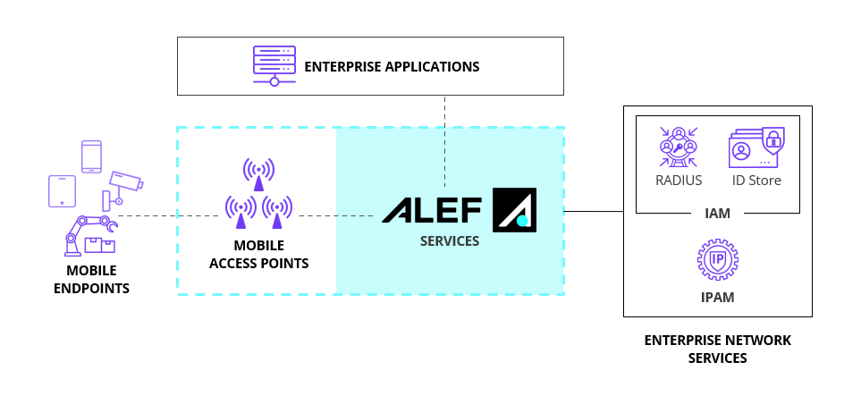

---
# Display h2 to h5 headings
toc_min_heading_level: 4
toc_max_heading_level: 5
---

# What we do

By taking away the complexity of setting up and maintaining a mobile
core, our set of simple APIs enable enterprises to experience the
benefits of private mobile edge networking.

Before Alef, there were 2 ways enterprises could deal with mobile
traffic:

** 1. Rely on the public mobile network**  
All user traffic needs to travel a significant distance out to the mobile provider core, before breaking out to be routed to enterprise resources or out to the internet.

** 2. Buy and maintain your own mobile infrastructure**  
To break out your mobile user traffic at or close to the enterprise
  resources, you would need to purchase and manage an expensive mobile
  core infrastructure.

Both the above options would necessitate a duplication of access control platforms, as your existing IAM and IPAM would not integrate with these solutions.

### Alef gives a **3rd option**
We enable you to:

- Manage mobile endpoints with your existing access infrastructure.
- Present mobile user traffic close to your resources without the need to run a mobile core of your own.
- Manage all elements of your mobile network, including your mobile APs, from one place.

<b>Fig 1: The Alef Private Mobile Network</b>

 

The Alef Enterprise Private Mobile solution enables enterprises to experience the benefits of private mobile networking without the expense and time of building and maintaining a mobile core network. We do this by integrating with your existing access technologies, and providing on or off prem Edge Points which enable mobile traffic to be presented close to enterprise resources. This gives you predictable latency performance for mission critical applications as well as more optimal routing to private cloud or branch office resources.

